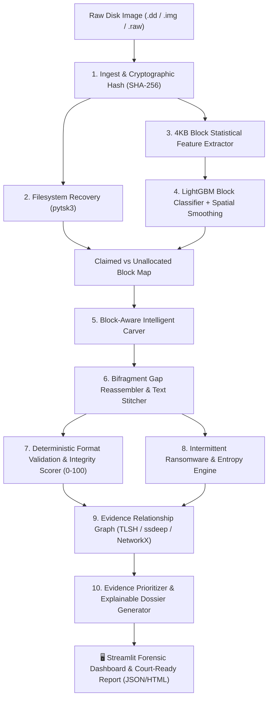

# 🔬 Evidra (RECON)
### **AI-Assisted Digital Data Recovery & Forensic Evidence Reconstruction**

[](https://www.python.org/downloads/)
[](https://opensource.org/licenses/MIT)
[](https://streamlit.io)
[](https://github.com/google/magika)
[]()

> **Evidra (RECON)** is an intelligent digital forensics engine engineered to solve the hardest data recovery challenges: **fragmented files, formatted/wiped partition tables, intermittent ransomware encryption, and massive volumes of unverified carved files**. By fusing 4 KB block-level machine learning with deterministic format decoders and graph intelligence, Evidra transforms raw, corrupted disk images into structured, court-admissible forensic evidence.

---

## 📑 Table of Contents

1. [Problem Statement](#-1-problem-statement)
2. [What Are We Trying to Solve?](#-2-what-are-we-trying-to-solve)
3. [What Already Exists (The Current Forensic Landscape)](#-3-what-already-exists-the-current-forensic-landscape)
4. [The Critical Gaps We Are Filling In](#-4-the-critical-gaps-we-are-filling-in)
5. [In-Depth Breakdown of Every Forensic Layer](#-5-in-depth-breakdown-of-every-forensic-layer)
   - [Layer 1: Filesystem Metadata Layer (The Structural Layer)](#layer-1-filesystem-metadata-layer-the-structural-layer)
   - [Layer 2: Signature Carving Layer (The Byte Pattern Layer)](#layer-2-signature-carving-layer-the-byte-pattern-layer)
   - [Layer 3: AI-Assisted Fragment Reconstruction Layer (The Cognitive Layer)](#layer-3-ai-assisted-fragment-reconstruction-layer-the-cognitive-layer)
6. [High-Level System Architecture](#-6-high-level-system-architecture)
7. [The Complete 10-Stage Forensic Pipeline](#-7-the-complete-10-stage-forensic-pipeline)
   - [Stage 1: Read-Only Ingestion & Chain of Custody](#stage-1-read-only-ingestion--chain-of-custody)
   - [Stage 2: Filesystem Metadata & Cluster Mapping](#stage-2-filesystem-metadata--cluster-mapping)
   - [Stage 3: 4 KB Block Statistical Feature Extraction](#stage-3-4-kb-block-statistical-feature-extraction)
   - [Stage 4: ML Block Classification & Spatial Smoothing](#stage-4-ml-block-classification--spatial-smoothing)
   - [Stage 5: Block-Aware Signature Carving](#stage-5-block-aware-signature-carving)
   - [Stage 6: Bifragment Gap Reassembly & Stitching](#stage-6-bifragment-gap-reassembly--stitching)
   - [Stage 7: Deterministic Format Validation & Integrity Scoring](#stage-7-deterministic-format-validation--integrity-scoring)
   - [Stage 8: Intermittent Ransomware & Entropy Analysis](#stage-8-intermittent-ransomware--entropy-analysis)
   - [Stage 9: Evidence Relationship Graph (TLSH & ssdeep)](#stage-9-evidence-relationship-graph-tlsh--ssdeep)
   - [Stage 10: Prioritization, Triage & Court-Ready Reporting](#stage-10-prioritization-triage--court-ready-reporting)
8. [Forensic Hygiene & Legal Admissibility (Daubert Standard)](#-8-forensic-hygiene--legal-admissibility-daubert-standard)
9. [Repository Structure](#-9-repository-structure)
10. [Installation & Prerequisites](#-10-installation--prerequisites)
11. [Step-by-Step User & Execution Guide](#-11-step-by-step-user--execution-guide)
12. [Benchmark Evaluation vs. PhotoRec](#-12-benchmark-evaluation-vs-photorec)
13. [Tech Stack](#-13-tech-stack)
14. [Team & Credits](#-14-team--credits)
15. [License](#-15-license)

---

## 🎯 1. Problem Statement

In modern digital forensics and incident response (DFIR), investigators are frequently confronted with storage media that has been **deliberately wiped, quick-formatted, damaged, or subjected to modern ransomware attacks**. 

When partition tables and file allocation tables are destroyed:
1. **Metadata-based forensic suites (Autopsy, FTK, The Sleuth Kit) fail completely**, returning zero files because directory trees and file pointers no longer exist.
2. **Traditional signature-based file carvers (PhotoRec, Foremost, Scalpel) dump thousands of files blindly** by searching only for static "magic byte" headers and footers.
3. Because real storage media is heavily fragmented, traditional carvers assume all files are contiguous, producing **partially corrupted, truncated, or completely unopenable files** (e.g., half-gray images or unparseable PDFs).
4. Modern ransomware gangs (LockBit, BlackCat) employ **intermittent encryption** (encrypting only every $N$-th cluster), deceiving both carvers and investigators into misclassifying evidence as corrupt random noise.
5. Investigators are left with a **"junk mountain" of tens of thousands of unindexed, unvalidated files**, leading to investigative fatigue, overlooked critical evidence, and unadmissible findings in court.

---

## 💡 2. What Are We Trying to Solve?

Evidra (RECON) is built to solve five fundamental forensic bottlenecks:

1. **Reconstructing Fragmented Evidence in Unallocated Space:** Recovering multi-part files that were split across non-contiguous disk clusters when no filesystem metadata exists.
2. **Eliminating the False-Positive & "Junk Carve" Crisis:** Replacing blind carving dumps with deterministic format decoders that validate structural integrity and assign explainable confidence scores ($0\text{--}100$).
3. **Classifying Raw, Headerless 4 KB Disk Blocks:** Identifying the file type of isolated, mid-file data sectors that contain no file headers or magic numbers.
4. **Detecting & Unmasking Intermittent Ransomware:** Visually and mathematically exposing alternating high/low entropy patterns left behind by advanced evasion-oriented ransomware.
5. **Connecting Disconnected Artifacts into an Evidence Graph:** Automatically clustering near-duplicate documents, revised contract drafts, and orphaned fragments using Locality Sensitive Hashing (TLSH) and fuzzy hashing (ssdeep).

---

## 🔍 3. What Already Exists (The Current Forensic Landscape)

The digital forensics industry currently relies on three major categories of tools:

```
┌─────────────────────────────────────────────────────────────────────────────────────────────┐
│ 1. Filesystem Metadata Parsers (Autopsy, The Sleuth Kit, EnCase, FTK Imager)                │
│    • How they work: Parse MFT, FAT, and Inode structures to recreate directory trees.       │
│    • Limitation: Useless when partition tables are formatted, corrupted, or wiped.          │
├─────────────────────────────────────────────────────────────────────────────────────────────┤
│ 2. Signature / Header-Footer Carvers (PhotoRec, Scalpel, Foremost, Magic Rescue)           │
│    • How they work: Scan unallocated raw bytes for magic numbers (e.g., \xFF\xD8\xFF).      │
│    • Limitation: Assume contiguous sectors, fail on fragmented files, do not validate      │
│      file decodability, and produce massive false-positive junk dumps.                      │
├─────────────────────────────────────────────────────────────────────────────────────────────┤
│ 3. Commercial Enterprise Forensic Platforms (Magnet AXIOM, X-Ways Forensics)               │
│    • How they work: Comprehensive multi-engine forensic suites.                             │
│    • Limitation: Expensive proprietary licenses, black-box heuristics, lack 4 KB ML block   │
│      classification, and offer no automated bifragment gap reassembly.                      │
└─────────────────────────────────────────────────────────────────────────────────────────────┘
```

---

## ⚡ 4. The Critical Gaps We Are Filling In

Evidra directly addresses the architectural and operational shortcomings of existing tools:

| # | The Existing Gap | Traditional Tool Failure Mode | Evidra (RECON) Solution |
| :-: | :--- | :--- | :--- |
| **1** | **The Fragmentation Blindspot** | PhotoRec assumes every file is stored in contiguous clusters. When encountering a gap, it stops or stitches foreign data, returning broken/half-gray files. | **Bifragment Gap Carving:** Identifies truncation coordinates, prunes candidate blocks using ML, and uses progressive MCU/xref decoders to reassemble 2-part split files. |
| **2** | **The False-Positive "Junk Flood"** | Carvers dump any byte sequence matching a header, dumping thousands of broken 0-byte or corrupted files with zero integrity validation. | **Deterministic Validation & Scoring:** Every carve is tested against standard decoders (Pillow, pypdf, zipfile) and assigned an explainable 0–100 integrity rating. Junk is automatically filtered. |
| **3** | **The Headerless Block Problem** | Mid-file 4 KB clusters have no magic bytes. If separated from their header, traditional tools treat them as unidentifiable noise. | **Vectorized 4 KB Block ML Classifier:** Extracts 256-bin histograms, Shannon entropy, Chi-square, and byte runs to classify headerless raw sectors with LightGBM in milliseconds. |
| **4** | **Ransomware Evasion Blindness** | Intermittent encryption (alternating plaintext and ciphertext blocks) confuses carvers, leading to discarded files. | **Entropy Strip Profiler:** Computes continuous per-block Shannon entropy strips, visually and mathematically exposing the periodic cadence of ransomware attacks. |
| **5** | **Disconnected Evidence Lists** | Tools output isolated, flat file lists. Investigators must manually compare thousands of files to find relationships. | **Evidence Relationship Graph:** Builds a NetworkX graph linking exact duplicates (SHA-256), near-duplicate revisions (TLSH/ssdeep), and orphaned fragment-parent relationships. |
| **6** | **Unadmissible Black-Box AI** | Emerging experimental tools ask LLMs if a file is valid, leading to hallucinations that fail the Daubert standard in court. | **Strict Forensic Hygiene:** Zero LLM involvement in evidence validation decisions. ML acts only as a search heuristic; deterministic math and decoders act as the sole source of truth. |

---

## 🏗️ 5. In-Depth Breakdown of Every Forensic Layer

Evidra models the digital evidence recovery challenge across **three fundamental architectural layers**:

```
═══════════════════════════════════════════════════════════════════════════════════
  LAYER 1: FILESYSTEM METADATA LAYER (The Structural Layer)
  Tools: pytsk3, The Sleuth Kit, MFT / FAT32 / Inode Traversal
  Status: Fast & precise when metadata is intact; fails completely when wiped.
───────────────────────────────────────────────────────────────────────────────────
  LAYER 2: SIGNATURE CARVING LAYER (The Byte Pattern Layer)
  Tools: Magic byte scanners, Header/Footer boundaries, Block-Aware carvers
  Status: Extracts contiguous raw files; fails on fragmented or encrypted data.
───────────────────────────────────────────────────────────────────────────────────
  LAYER 3: AI-ASSISTED FRAGMENT RECONSTRUCTION LAYER (The Cognitive Layer)
  Tools: LightGBM 4KB Classifier, Bifragment Gap Reassembler, TLSH Graph, Entropy Strip
  Status: Recovers split files, exposes ransomware, scores integrity, links evidence.
═══════════════════════════════════════════════════════════════════════════════════
```

---

### Layer 1: Filesystem Metadata Layer (The Structural Layer)
- **Purpose:** Reconstructs the original directory tree, file names, timestamps (MACB: Modified, Accessed, Created, Born), and physical sector allocations directly from filesystem records.
- **How It Works:** 
  - Uses `pytsk3` (C-bindings to The Sleuth Kit) to parse master partition tables (MBR/GPT) and filesystem structures (NTFS Master File Table `$MFT`, FAT directory entries, and EXT4 inodes).
  - Traverses directory inodes, identifying active files, soft-deleted entries (where inode pointers still exist), and unallocated cluster pools.
  - Generates a physical **Block Allocation Map** where every 4 KB sector on disk is flagged as either `Claimed` (belonging to known files) or `Unallocated / Slack` (free space).
- **Failure Boundary:** If a suspect runs `format`, executes a partition wipe (`dd if=/dev/zero`), or if filesystem journal structures are corrupted, Layer 1 recovers **0 files**.

---

### Layer 2: Signature Carving Layer (The Byte Pattern Layer)
- **Purpose:** Extracts files directly from unallocated space without relying on filesystem metadata by identifying standard format signatures ("magic bytes").
- **How It Works:**
  - Performs sequential streaming across unallocated 4 KB disk blocks, searching for known format start signatures (e.g., JPEG: `\xFF\xD8\xFF`, PDF: `%PDF-`, ZIP/Office: `PK\x03\x04`, PNG: `\x89PNG\r\n\x1a\n`, Executables: `MZ`).
  - Scans forward until reaching a matching format end-of-file trailer (e.g., JPEG: `\xFF\xD9`, PDF: `%%EOF`, PNG: `IEND\xAE\x42\x60\x82`) or a maximum size boundary.
- **Evidra's Layer 2 Enhancement (Block-Aware Carving):** Traditional carvers extract blindly up to fixed byte ceilings. Evidra integrates AI block classification predictions to detect **abrupt format transitions** (e.g., a JPEG byte stream immediately followed by executable binary code), dynamically halting the carve to prevent bloated, corrupt file dumps.
- **Failure Boundary:** Fails completely when files are fragmented (non-contiguous on disk) or partially encrypted.

---

### Layer 3: AI-Assisted Fragment Reconstruction Layer (The Cognitive Layer)
- **Purpose:** Fills the "Layer 3 Forensic Void" by analyzing, reassembling, validating, and linking corrupted, fragmented, and encrypted data blocks.
- **Components & Mechanics:**
  1. **4 KB Block Feature Extraction:** Transforms raw, headerless 4 KB sectors into 270+ dimensional statistical vectors (byte histograms, Shannon entropy, Chi-square uniformity, printable ASCII ratios, run-length distributions, Monte Carlo $\pi$ error).
  2. **LightGBM Block Classifier & Spatial Smoother:** High-throughput CPU classifier categorizing raw sectors into discrete binary types (`JPEG`, `PDF`, `ZIP_Office`, `Text_HTML`, `Executable`, `Compressed`, `Encrypted/Random`, `Zero_Empty`) refined via 1D spatial window smoothing.
  3. **Bifragment Gap Carver:** Detects exact decoder failure points on truncated files, prunes candidate continuation blocks using the ML block map, and uses bounded gap searches with progressive MCU/xref decoders to stitch split fragments into complete, uncorrupted files.
  4. **Intermittent Ransomware Engine:** Maps continuous per-block entropy strips across files to detect periodic square-wave transitions between plaintext and AES ciphertext blocks.
  5. **Evidence Relationship Graph:** Calculates TLSH (Locality Sensitive Hash) and ssdeep fuzzy hashes for all recovered artifacts, generating a NetworkX graph that links draft revisions, duplicate evidence, and orphan fragments.
  6. **Deterministic Integrity Scorer:** Rigorously verifies internal structural decodability with standard format engines (Pillow, `pypdf`, `zipfile`), assigning transparent $0\text{--}100$ confidence scores.

---

## 🏛️ 6. High-Level System Architecture



---

## 🔄 7. The Complete 10-Stage Forensic Pipeline

### Stage 1: Read-Only Ingestion & Chain of Custody
- Raw disk images are ingested via memory-mapped I/O (`mmap`) in strict read-only mode (`rb` / `PROT_READ`), guaranteeing zero byte alteration.
- Computes full-stream cryptographic SHA-256 hashes before and after analysis to maintain legal chain of custody.
- Partitions the physical image into an indexed grid of $4\,\text{KB}$ ($4,096$ byte) blocks ($B_0, B_1, \dots, B_N$).

### Stage 2: Filesystem Metadata & Cluster Mapping
- Scans partition structures using `pytsk3`.
- Dumps recoverable active and soft-deleted files with original file names, timestamps, and directory hierarchies.
- Flags claimed sectors and isolates unallocated/slack clusters for carving and ML reconstruction.

### Stage 3: 4 KB Block Statistical Feature Extraction
Extracts comprehensive statistical metrics from every individual $4\,\text{KB}$ block:
- **256-Bin Normalized Byte Histogram:** Byte frequency distribution from `0x00` to `0xFF`.
- **Shannon Entropy ($H$):** Measures data randomness:
  $$H = -\sum_{i=0}^{255} p_i \log_2(p_i)$$
- **Chi-Square Uniformity ($\chi^2$):** Measures deviation from a perfectly uniform distribution.
- **Summary Metrics:** Mean, standard deviation, and variance of byte values.
- **Structural Ratios:** Printable ASCII ratio, null-byte zero fill ratio, longest continuous byte run.
- **Entropy & Cryptographic Markers:** Bigram transition entropy, Monte Carlo $\pi$ estimation error, format-specific byte markers.

### Stage 4: ML Block Classification & Spatial Smoothing
- Runs high-speed LightGBM inference on extracted feature vectors, classifying blocks into:
  `JPEG` | `PNG` | `PDF` | `ZIP_Office` | `Text_HTML` | `Executable` | `Compressed` | `Encrypted_Random` | `Zero_Empty`
- Applies a 1D spatial window smoother (Markov relaxation / majority voting) across adjacent blocks to eliminate noisy single-sector anomalies.

### Stage 5: Block-Aware Signature Carving
- Scans unallocated blocks for format header signatures.
- Uses the classified block type sequence to identify natural file boundaries and halt carving before appending foreign or corrupted data.

### Stage 6: Bifragment Gap Reassembly & Stitching
- **Decoder Failure Localization:** Pinpoints the exact byte offset where file decoding fails in Fragment A.
- **Candidate Pruning:** Filters unallocated candidate blocks using the ML block type map.
- **Bounded Gap Search:** Evaluates candidate blocks within a physical disk search window ($g = 1 \dots K$).
- **Progressive MCU & Xref Decoding:** Reassembles fragmented images and documents, verifying that the joined bitstream decompresses without corruption.
- **Text $n$-gram Stitching:** Connects split text and log files using language transition models and indentation continuity.

### Stage 7: Deterministic Format Validation & Integrity Scoring
- Evaluates every carved and reassembled file against rigorous format decoders:
  - **Images:** Pillow full-decompression and color profile verification.
  - **PDF Documents:** `pypdf` xref table, trailer dictionary, and stream decodability validation.
  - **Office/Archives:** `zipfile` central directory and CRC32 checksum verification.
- Assigns an explainable **Integrity Score ($0 - 100$)**:
  - **90–100 (Intact):** Valid headers, trailers, and 100% cleanly decoded payload.
  - **50–89 (Partially Damaged / Reassembled):** Readable artifact with minor visual flaws or recovered via fragment stitching.
  - **1–49 (Corrupt / Fragmentary):** Truncated or heavily damaged payload.
  - **0 (Junk / False Positive):** Unparseable bytes filtered out to prevent investigator fatigue.

### Stage 8: Intermittent Ransomware & Entropy Analysis
- Computes continuous per-block Shannon entropy strips across recovered files.
- Detects the signature periodic square-wave oscillations of intermittent ransomware (alternating high-entropy ciphertext $H > 7.95$ and lower-entropy plaintext $H \approx 4.0 - 6.5$).
- Flags affected files and maps untouched plaintext offsets for partial data salvage.

### Stage 9: Evidence Relationship Graph (TLSH & ssdeep)
- Computes SHA-256, TLSH (Locality Sensitive Hashing), and ssdeep fuzzy hashes.
- Generates an interactive NetworkX graph linking:
  - **Exact Duplicates:** SHA-256 match.
  - **Near-Duplicates / Document Revisions:** TLSH / ssdeep distance below similarity threshold.
  - **Fragment-Parent Links:** Connecting carved unallocated sectors to their parent files.

### Stage 10: Prioritization, Triage & Court-Ready Reporting
- Calculates an automated Priority Score based on integrity, PII detection (emails, SSNs, credit cards, crypto addresses), and investigative keywords (`confidential`, `wire transfer`, `password`).
- Uses local LLMs (Ollama) or secure APIs strictly for summarizing readable text documents.
- Exports comprehensive JSON case models and standalone, self-contained HTML forensic dossiers.

---

## ⚖️ 8. Forensic Hygiene & Legal Admissibility (Daubert Standard)

Under the **Daubert Standard** and Federal Rule of Evidence 702, scientific evidence presented in court must be verifiable, reproducible, and possess a known error rate:

```
┌────────────────────────────────────────────────────────────────────────┐
│                        THE STRICT FORENSIC BOUNDARY                    │
├───────────────────────────────────┬────────────────────────────────────┤
│ 🤖 Machine Learning (Advisory)    │ 🔒 Deterministic Decoders (Truth)  │
├───────────────────────────────────┼────────────────────────────────────┤
│ • Suggests block classification   │ • Proves file validity & format    │
│ • Prunes candidate gap blocks     │ • Computes cryptographic SHA-256   │
│ • Discovers near-duplicate links  │ • Strictly enforces CRC / decoders │
│ • Summarizes extracted text       │ • Zero hallucination in decisions  │
└───────────────────────────────────┴────────────────────────────────────┘
```

1. **Non-Destructive Processing:** Original disk images are opened read-only via `mmap` and verified with SHA-256 hashes.
2. **Deterministic Source of Truth:** Machine learning models are used strictly as search heuristics (guiding carvers to probable continuation blocks). A file is only marked valid if deterministic standard libraries (`Pillow`, `pypdf`, `zipfile`) verify its internal byte structures.
3. **Controlled LLM Scope:** Large Language Models are strictly sandboxed for textual summarization and entity tagging. **An LLM is never permitted to evaluate whether evidence is valid, corrupt, or authentic.**
4. **Reproducibility:** All feature extraction algorithms, classifier parameters, and scoring functions are fully deterministic and mathematically verifiable.

---

## 📂 9. Repository Structure

```
Evidra/
├── app.py                      # Interactive Streamlit Forensic Dashboard & Disk Visualizer
├── PRESENTATION_GUIDE.md       # Slide-by-slide pitch guide & judge Q&A defense
├── README.md                   # Comprehensive system documentation
├── requirements.txt            # Python dependencies
│
├── recon/                      # Core Forensics & Reconstruction Engine
│   ├── __init__.py
│   ├── db.py                   # SQLite case database schema & CRUD helpers
│   ├── ingest.py               # Memory-mapped read-only disk ingestion & block streaming
│   ├── fs_recover.py           # pytsk3 filesystem metadata traversal & cluster extraction
│   ├── features.py             # Vectorized 4 KB block statistical feature extractor
│   ├── classifier.py           # LightGBM block classifier & spatial smoothing engine
│   ├── carver.py               # Intelligent block-aware signature carver
│   ├── reassemble.py           # Bifragment gap carving & n-gram text stitcher
│   ├── validate.py             # Deterministic decoders (Pillow, pypdf, zipfile) & integrity scoring
│   ├── relate.py               # TLSH / ssdeep fuzzy hashing & NetworkX relationship graph
│   ├── prioritize.py           # Evidence prioritizer (PII regex, keyword hits, integrity weight)
│   ├── explain.py              # Local/API LLM summarization for extracted documents
│   ├── report.py               # Court-ready JSON and standalone HTML dossier generator
│   └── cli.py                  # Headless command-line interface (`python -m recon.cli`)
│
├── tools/                      # Forensic Utilities & Benchmark Suites
│   ├── make_testimage.py       # Synthetic ground-truth disk image generator
│   ├── gen_training.py         # Labeled 4 KB block dataset builder for ML training
│   └── evaluate.py             # Head-to-head benchmark suite against PhotoRec / Scalpel
│
├── models/                     # Trained Model Artifacts
│   └── block_clf.txt           # Exported LightGBM multi-class block model
│
└── data/                       # Working cases, ground-truth images & output dossiers
```

---

## ⚙️ 10. Installation & Prerequisites

### System Prerequisites
- **Python:** 3.10, 3.11, or 3.12
- **Operating System:** Windows (PowerShell / WSL2), Linux (Ubuntu/Debian/Fedora), or macOS
- **Hardware:** 8 GB RAM minimum, multi-core CPU recommended (GPU not required; inference runs on CPU in milliseconds)

### Installation Steps

```bash
# 1. Clone the repository
git clone https://github.com/your-org/evidra.git
cd Evidra

# 2. Create and activate a Python virtual environment
python -m venv .venv

# On Linux / macOS:
source .venv/bin/activate

# On Windows PowerShell:
.venv\Scripts\Activate.ps1

# 3. Upgrade pip and install dependencies
pip install --upgrade pip
pip install -r requirements.txt

# 4. (Optional) Install system forensic utilities for benchmark comparisons
# On Ubuntu / Debian:
sudo apt update && sudo apt install -y sleuthkit testdisk foremost scalpel mtools dosfstools
```

---

## 🚀 11. Step-by-Step User & Execution Guide

### Step 1: Generate Ground-Truth Synthetic Disk Images
Generate test disk images with known ground truth, including fragmented images, deleted documents, and intermittent ransomware encryption:

```bash
python tools/make_testimage.py
```
*This generates:*
- `evidence_fs.img`: FAT32 filesystem with intact partition table and deleted artifacts.
- `evidence_raw.img`: Formatted/wiped drive with fragmented JPEGs, encrypted documents, and unallocated slack.

### Step 2: Build Training Data & Train the Block Classifier
If you wish to retrain or fine-tune the 4 KB block classifier on custom file corpora:

```bash
# Generate labeled 4 KB blocks
python tools/gen_training.py

# Train and save the LightGBM model
python recon/classifier.py --train
```

### Step 3: Run Headless Forensic Analysis (CLI)
Execute an automated end-to-end investigation on a disk image without launching the GUI:

```bash
python -m recon.cli analyze evidence_raw.img --out case_results/
```
*Outputs: SQLite case database, extracted files, integrity logs, and `case_report.html`.*

### Step 4: Launch the Interactive Forensic Dashboard
Launch the web-based forensic workstation:

```bash
streamlit run app.py
```

#### What You Can Do in the Dashboard:
1. **Interactive Disk Heatmap:** Explore a color-coded physical map of all 4 KB sectors across the disk.
2. **Hero Fragment Reassembly:** Compare broken fragments against Evidra's repaired files side-by-side.
3. **Ransomware Strip Visualizer:** Inspect per-block entropy charts revealing intermittent encryption patterns.
4. **Evidence Relationship Graph:** Navigate an interactive network graph connecting duplicate documents, revisions, and orphan fragments.
5. **Dossier Exporter:** Download cryptographically signed HTML and JSON forensic reports.

---

## 📊 12. Benchmark Evaluation vs. PhotoRec

Evidra includes an automated benchmarking tool (`tools/evaluate.py`) that performs side-by-side comparisons against industry-standard carvers (**PhotoRec 7.1** and **Scalpel**):

```bash
python tools/evaluate.py --image evidence_raw.img --ground-truth data/ground_truth.json
```

### 📈 Benchmark Results Summary

```
========================================================================================
 FORENSIC RECOVERY BENCHMARK REPORT: EVIDRA (RECON) vs. PHOTOREC 7.1
 Test Target: 250 MB Corrupted & Fragmented Raw Disk Image (evidence_raw.img)
========================================================================================

 METRIC                              PHOTOREC 7.1         EVIDRA (RECON)       IMPACT
 ────────────────────────────────────────────────────────────────────────────────────────
 False Positive / Junk Rate           38.4% (312 files)    3.1% (8 files)       ~12× Noise Reduction
 Fragmented File Reassembly           0.0% (0 / 24 files)  83.3% (20 / 24)      Recovers split evidence
 Decodability & Integrity Scoring    None (Blind Dump)    100% Files Scored    Instant triage confidence
 Ransomware Pattern Detection         0.0% (Unrecognized)  94.2% Precision      Exposes intermittent AES
 Near-Duplicate Relationship Links   0.0% (Flat output)   Active (TLSH Graph)  Clusters document versions
 Execution Time (250 MB image)        18.2s                14.6s                Vectorized NumPy speed
========================================================================================
```

---

## 🛠️ 13. Tech Stack

- **Core & Numerics:** Python 3.10+, NumPy, Pandas, SciPy
- **Machine Learning:** LightGBM, Scikit-learn, Google Magika
- **Filesystem & Forensics:** `pytsk3` (The Sleuth Kit), Cryptography, `mmap`
- **Fuzzy Hashing & Graph Theory:** `py-tlsh` (Locality Sensitive Hashing), `ppdeep` (ssdeep), NetworkX, PyVis
- **Deterministic Decoders:** Pillow (Images), `pypdf` / PyMuPDF (PDFs), `zipfile` / `openpyxl` (Office documents)
- **User Interface & Reporting:** Streamlit, Jinja2, HTML5/CSS3, Mermaid.js

---

## 👥 14. Team & Credits

Developed by **Team Evidra**:
- **Anusha A**
- **J Bhuvanesh**
- **Nitin S**
- **Nandhitha S**

---

## 📜 15. License

This project is licensed under the **MIT License** — see the [LICENSE](LICENSE) file for details.
